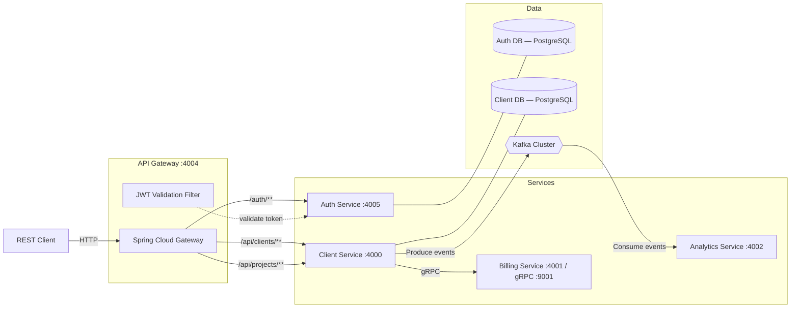

# ClientHUB — client & Project Management System

A **microservices-based** client/client management platform built with **Spring Boot 4.1**, **gRPC**, **Apache Kafka**, and **AWS CDK** (LocalStack). The system allows managing clients (clients), submitting and accepting freelance projects, generating billing receipts, and streaming analytics events — all behind a secure API Gateway with JWT authentication.

---

## Architecture Overview



### Service Communication

| From | To | Protocol | Purpose |
|---|---|---|---|
| API Gateway | Auth Service | HTTP | JWT token validation |
| API Gateway | Client Service | HTTP (proxied) | Client & project CRUD |
| Client Service | Billing Service | **gRPC** (port 9001) | Create billing accounts & generate receipts |
| Client Service | Kafka | **Protobuf over Kafka** | Publish `client` and `projects` events |
| Analytics Service | Kafka | **Protobuf over Kafka** | Consume & log `client` and `projects` events |

---

## Tech Stack

| Layer | Technology |
|---|---|
| Language | Java 21 |
| Framework | Spring Boot 4.1, Spring Cloud Gateway (WebFlux) |
| Database | PostgreSQL 17 (+ H2 for dev) |
| ORM | Spring Data JPA / Hibernate |
| Authentication | JWT (HMAC-SHA, via `jjwt`), Spring Security |
| Inter-service (sync) | gRPC 1.69 + Protobuf 4.29 |
| Inter-service (async) | Apache Kafka (Spring Kafka) |
| Serialization | Protocol Buffers |
| Infrastructure | AWS CDK (Java), ECS Fargate, RDS, MSK, ALB |
| Local Cloud | LocalStack |
| Build | Maven 3.9, multi-stage Docker |
| Testing | JUnit 5, REST Assured (integration tests) |

---

## Services

### 1. API Gateway (`api-gateway` — port 4004)

The single entry point for all external requests. Built on **Spring Cloud Gateway (WebFlux)**.

- **Routes**:
  - `/auth/**` → Auth Service (no JWT filter)
  - `/api/clients/**` → Client Service (JWT required)
  - `/api/projects/**` → Client Service (JWT required)
- **JWT Validation Filter** — calls the Auth Service's `/validate` endpoint before forwarding requests.

### 2. Auth Service (`auth-service` — port 4005)

Handles user authentication and JWT token management.

- **Endpoints**:
  - `POST /login` — Authenticate with email/password, returns JWT token
  - `GET /validate` — Validate a Bearer token (used by API Gateway)
- **Database**: Separate PostgreSQL instance for user credentials
- **Roles**: `ADMIN`, `ROLE_CLIENT`, `ROLE_DEVELOPER`
- **Token TTL**: 10 hours

### 3. Client Service (`Client-service` — port 4000)

Core business service managing clients (clients) and projects.

#### Client Endpoints

| Method | Path | Description |
|---|---|---|
| `GET` | `/client/getAllClient` | List all clients |
| `POST` | `/client/createClient` | Create a new client |
| `PUT` | `/client/updateClient/{id}` | Update client info |
| `DELETE` | `/client/deleteClient/{id}` | Delete a client |

#### Project Endpoints

| Method | Path | Description |
|---|---|---|
| `POST` | `/projects/createProject` | Submit a new project |
| `GET` | `/projects/getAllProjects` | List all projects |
| `GET` | `/projects/getOpenProjects` | List open/available projects |
| `GET` | `/projects/getProject/{id}` | Get project by ID |
| `POST` | `/projects/acceptProject/{id}` | Developer accepts a project |

**Key behaviors**:
- On client creation → gRPC call to Billing Service to create billing account + Kafka event
- On project creation → Kafka `PROJECT_SUBMITTED` event
- On project acceptance → gRPC call to Billing Service for receipt generation + Kafka `PROJECT_ACCEPTED` event

### 4. Billing Service (`billing-service` — port 4001, gRPC port 9001)

Exposes a **gRPC server** for billing operations.

| RPC Method | Request | Response | Description |
|---|---|---|---|
| `createBillingAccount` | `BillingRequest` | `BillingResponse` | Creates a billing account for a client |
| `generateReceipt` | `ReceiptRequest` | `ReceiptResponse` | Generates a receipt when a project is accepted |

### 5. Analytics Service (`analytics-service` — port 4002)

**Kafka consumer** that subscribes to event topics and logs analytics data.

| Topic | Event Type | Data |
|---|---|---|
| `client` | `clientEvent` | Client ID, name, email, event type |
| `projects` | `ProjectEvent` | Project ID, client ID, developer ID, title, budget, receipt ID, event type |

---

## Data Models

### Client (client) Entity

| Field | Type | Constraints |
|---|---|---|
| `id` | UUID | Primary Key, auto-generated |
| `name` | String | Not null |
| `email` | String | Not null, unique |
| `address` | String | Not null |
| `dateOfBirth` | LocalDate | Not null |
| `registeredDate` | LocalDate | Not null |

### Project Entity

| Field | Type | Constraints |
|---|---|---|
| `id` | UUID | Primary Key, auto-generated |
| `title` | String | Not null |
| `description` | String | Max 2000 chars |
| `budget` | BigDecimal | Not null |
| `status` | Enum | `OPEN`, `ACCEPTED`, `IN_PROGRESS`, `COMPLETED`, `CANCELLED` |
| `clientId` | UUID | — |
| `developerId` | UUID | — |
| `receiptId` | String | Set on project acceptance |
| `createdAt` | LocalDateTime | Auto-set on creation |
| `acceptedAt` | LocalDateTime | Set on acceptance |

### User Entity (Auth)

| Field | Type | Constraints |
|---|---|---|
| `id` | UUID | Primary Key |
| `email` | String | Not null, unique |
| `password` | String | Not null (BCrypt hashed) |
| `role` | String | Not null (`ADMIN`, `ROLE_CLIENT`, `ROLE_DEVELOPER`) |

---

## Getting Started

### Prerequisites

- **Java 21** (JDK)
- **Maven 3.9+**
- **Docker** & **Docker Compose** (for containerized runs)
- **PostgreSQL 17+** (or use the Docker-based instances)
- **Apache Kafka** (or use LocalStack/Docker)
- **LocalStack** (optional — for AWS infrastructure emulation)

[//]: # (### Environment Variables)

[//]: # (| Variable | Default | Used By |)

[//]: # (|---|---|---|)

[//]: # (| `SPRING_DATASOURCE_URL` | `jdbc:postgresql://localhost:5000/db` | Client Service |)

[//]: # (| `SPRING_DATASOURCE_USERNAME` | `admin_user` | Client Service |)

[//]: # (| `SPRING_DATASOURCE_PASSWORD` | `password` | Client Service |)

[//]: # (| `SPRING_KAFKA_BOOTSTRAP_SERVERS` | `localhost:9092` | Client Service |)

[//]: # (| `JWT_SECRET` | *&#40;required&#41;* | Auth Service |)

[//]: # (| `BILLING_SERVICE_ADDRESS` | `localhost` | Client Service |)

[//]: # (| `BILLING_SERVICE_GRPC_PORT` | `9001` | Client Service |)

[//]: # (| `AUTH_SERVICE_URL` | *&#40;required&#41;* | API Gateway |)

[//]: # (| `SPRING_PROFILES_ACTIVE` | *&#40;none&#41;* | API Gateway &#40;`prod` for Docker&#41; |)

### Run Locally (Individual Services)

```bash
# 1. Start PostgreSQL & Kafka (ensure they are running)

# 2. Build & run each service
cd auth-service && ./mvnw spring-boot:run
cd Client-service && ./mvnw spring-boot:run
cd billing-service && ./mvnw spring-boot:run
cd analytics-service && ./mvnw spring-boot:run
cd api-gateway && ./mvnw spring-boot:run
```

### Run with Docker

Each service has a multi-stage `Dockerfile`:

```bash
# Build images
docker build -t auth-service ./auth-service
docker build -t client-service ./Client-service
docker build -t billing-service ./billing-service
docker build -t analytics-service ./analytics-service
docker build -t api-gateway ./api-gateway
```

[//]: # (### Deploy to LocalStack &#40;AWS Emulation&#41;)

[//]: # ()
[//]: # (The `Infrastructure/` module uses **AWS CDK &#40;Java&#41;** to provision the full stack on LocalStack:)

[//]: # ()
[//]: # (```bash)

[//]: # (# Synthesize the CloudFormation template)

[//]: # (cd Infrastructure && mvn compile exec:java)

[//]: # ()
[//]: # (# Deploy to LocalStack)

[//]: # (./localstack-deploy.sh)

[//]: # (```)

[//]: # ()
[//]: # (**Provisioned resources**: VPC, RDS &#40;PostgreSQL&#41;, MSK &#40;Kafka&#41;, ECS Fargate services, Application Load Balancer.)

---

## Seed Data

The system auto-seeds data on startup via `data.sql` files:

**Auth Service** — 3 test users:
| Email | Password | Role |
|---|---|---|
| `testuser@test.com` | `password123` | `ADMIN` |
| `client@test.com` | `password123` | `ROLE_CLIENT` |
| `developer@test.com` | `password123` | `ROLE_DEVELOPER` |

**Client Service** — 15 pre-loaded sample clients/clients.

---

## Integration Tests

Located in `Integeration-tests/`, using **REST Assured** against the running system (port 4004):

```bash
cd Integeration-tests && mvn test
```

- `AuthIntegrationTest` — Validates login returns a JWT token
- `clientIntegrationTest` — Validates authenticated client listing

---

## Project Structure

```
client-Management-System/
├── api-gateway/                  # Spring Cloud Gateway (WebFlux)
│   └── src/main/java/.../filter/ #   JWT validation filter
├── auth-service/                 # Authentication & JWT service
│   └── src/main/resources/       #   data.sql (seed users)
├── Client-service/               # Core client & project management
│   ├── src/main/java/.../
│   │   ├── controller/           #   REST controllers
│   │   ├── model/                #   JPA entities
│   │   ├── service/              #   Business logic
│   │   ├── grpc/                 #   gRPC client for billing
│   │   ├── kafka/                #   Kafka producer
│   │   └── dto/                  #   Request/response DTOs
│   └── src/main/proto/           #   Protobuf definitions
├── billing-service/              # gRPC billing server
│   └── src/main/proto/           #   billing_service.proto
├── analytics-service/            # Kafka consumer for event analytics
│   └── src/main/proto/           #   Event protobuf schemas
├── Infrastructure/               # AWS CDK (Java) — LocalStack deployment
│   ├── src/main/java/.../        #   CDK stack definition
│   ├── cdk.out/                  #   Synthesized CloudFormation
│   └── localstack-deploy.sh      #   Deployment script
├── Integeration-tests/           # REST Assured integration tests
└── README.md
```

---

## API Quick Reference

> All routes go through the API Gateway at `http://localhost:4004`

### Authentication

```bash
# Login (no JWT required)
curl -X POST http://localhost:4004/auth/login \
  -H "Content-Type: application/json" \
  -d '{"email": "testuser@test.com", "password": "password123"}'

# Response: {"jwtToken": "eyJhbGciOi..."}
```

### Client Operations (JWT required)

```bash
# Get all clients
curl http://localhost:4004/api/clients/getAllclients \
  -H "Authorization: Bearer <token>"

# Create a client
curl -X POST http://localhost:4004/api/clients/createclient \
  -H "Authorization: Bearer <token>" \
  -H "Content-Type: application/json" \
  -d '{"name": "New Client", "email": "new@example.com", "address": "123 St", "dateOfBirth": "1990-01-01"}'
```

### Project Operations (JWT required)

```bash
# Create a project
curl -X POST http://localhost:4004/api/projects/createProject \
  -H "Authorization: Bearer <token>" \
  -H "Content-Type: application/json" \
  -d '{"title": "Website Redesign", "description": "Full redesign", "budget": 5000, "clientId": "<uuid>"}'

# Accept a project (as developer)
curl -X POST http://localhost:4004/api/projects/acceptProject/<project-id> \
  -H "Authorization: Bearer <token>" \
  -H "Content-Type: application/json" \
  -d '{"developerId": "<developer-uuid>"}'
```

---

## Protobuf Definitions

### `billing_service.proto`

```protobuf
service BillingService {
  rpc createBillingAccount(BillingRequest) returns (BillingResponse);
  rpc generateReceipt(ReceiptRequest) returns (ReceiptResponse);
}
```

### `client_events.proto` / `project_events.proto`

Used for Kafka event serialization between Client Service (producer) and Analytics Service (consumer).

---

## License

This project is for educational / portfolio purposes.
